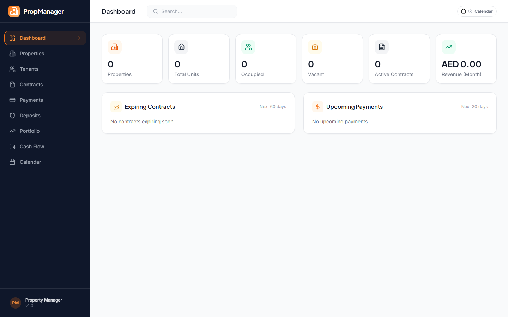
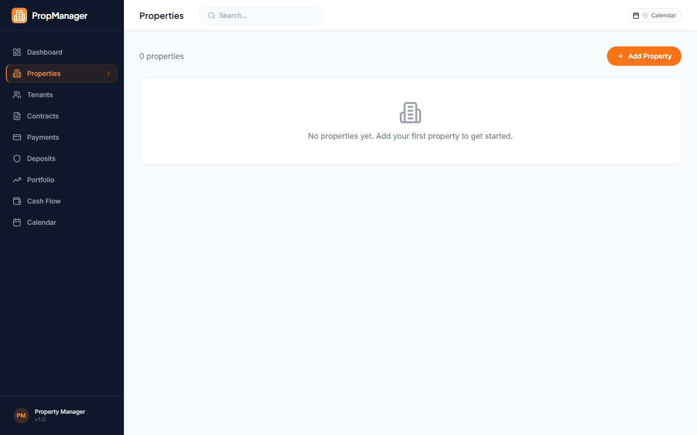
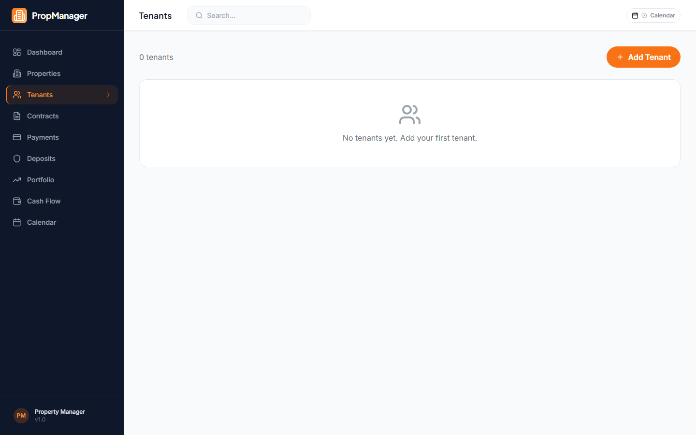
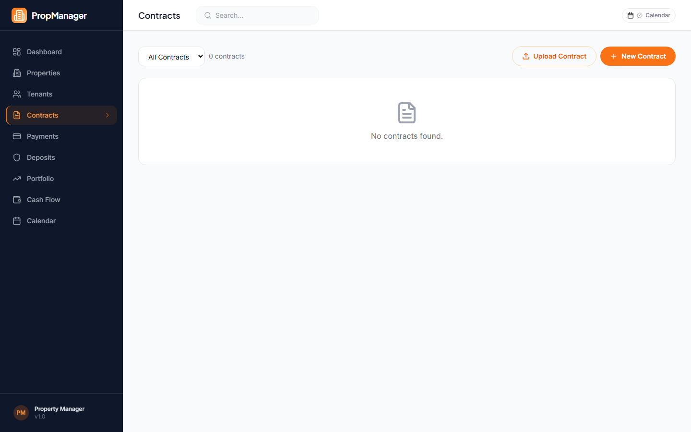
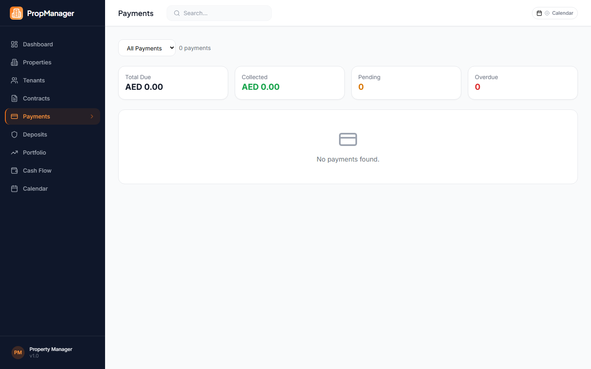

# Estater

Full-stack property management application built for the UAE real estate market. Manage properties, tenants, contracts, payments, mortgages, and valuations — with AI-powered contract analysis and Google Calendar integration.

## Screenshots

| Dashboard | Properties | Tenants |
|-----------|-----------|---------|
|  |  |  |

| Contracts | Payments |
|-----------|----------|
|  |  |

## Tech Stack

- **Frontend**: React 19 + TypeScript + Vite 6 + Tailwind CSS
- **Backend**: Express.js + TypeScript (tsx)
- **Database**: SQLite (better-sqlite3) with WAL journaling
- **AI**: Anthropic Claude (contract analysis & report generation)
- **Maps**: Google Maps API
- **Calendar**: Google Calendar API sync
- **Charts**: Recharts
- **Animations**: Framer Motion
- **Icons**: Lucide React
- **Testing**: Vitest + Testing Library
- **Export**: PDF (pdfmake) + Excel (xlsx)

## Features

- **Property Management** — Track properties across UAE emirates with unit-level detail
- **Tenant Lifecycle** — Manage tenants, contracts, renewals, and deposits
- **Payment Tracking** — Record payments, detect overdue, generate schedules
- **Mortgage Calculator** — Amortization schedules with interactive charts
- **Property Valuation** — Portfolio analysis with market comparisons
- **Expense Tracking** — Categorized expenses with summary charts
- **AI Contract Analysis** — Upload contracts for Claude AI-powered review
- **Document Templates** — Generate contracts, invoices, and notices from templates
- **Google Calendar Sync** — Sync payment due dates and contract events
- **Market Data** — Integration with ADREC and Dubai Land Department APIs
- **Multi-Currency** — Support for AED and other currencies
- **Cash Flow Analysis** — Net income charts, collection rates, vacancy costs
- **Audit Trail** — Full change history with diff visualization
- **Reports** — Generate and export PDF/Excel reports
- **Command Palette** — Quick navigation across the app
- **PWA Support** — Installable as a Progressive Web App
- **Mobile Responsive** — Full mobile navigation support

## Quick Start

### Prerequisites

- Node.js >= 18
- npm

### Setup

```bash
# Install dependencies
npm install

# Copy environment config
cp .env.example .env
# Edit .env with your API keys (all optional)

# Run database migrations
npm run db:migrate

# Start development (frontend + backend concurrently)
npm run dev
```

The app will be available at `http://localhost:5173` with the API at `http://localhost:3001`.

### Environment Variables

```env
ANTHROPIC_API_KEY=          # Claude AI for contract analysis (optional)
GOOGLE_CLIENT_ID=           # Google Calendar sync (optional)
GOOGLE_CLIENT_SECRET=       # Google Calendar sync (optional)
GOOGLE_REDIRECT_URI=        # Google OAuth callback URL
GOOGLE_MAPS_API_KEY=        # Google Maps embedded view (optional)
INBOUND_WEBHOOK_SECRET=     # Webhook authentication (optional)
```

All integrations gracefully degrade when API keys are not provided.

## Available Scripts

| Command | Description |
|---------|-------------|
| `npm run dev` | Start frontend + backend in watch mode |
| `npm run build` | Build production frontend |
| `npm start` | Start production server |
| `npm run db:migrate` | Run database migrations |
| `npm test` | Run tests with Vitest |
| `npm run test:watch` | Run tests in watch mode |

## Project Structure

```
├── src/                    # React frontend
│   ├── pages/              # 23 page components (lazy-loaded)
│   ├── components/         # Reusable components
│   │   ├── ai/             # Contract analysis UI
│   │   ├── charts/         # Recharts visualizations
│   │   ├── dashboard/      # Dashboard widgets
│   │   ├── layout/         # App layout & navigation
│   │   ├── maps/           # Google Maps integration
│   │   ├── mortgage/       # Mortgage calculator
│   │   ├── templates/      # Document generation
│   │   ├── ui/             # Base UI components
│   │   └── valuation/      # Property valuation
│   ├── contexts/           # Auth context
│   ├── hooks/              # Custom hooks
│   ├── types/              # TypeScript definitions
│   └── utils/              # Formatters & helpers
├── server/                 # Express backend
│   ├── routes/             # 22 API route modules
│   ├── services/           # External integrations
│   ├── middleware/          # Auth, audit, error handling
│   ├── utils/              # Generators & renderers
│   └── db/
│       ├── migrations/     # 15 sequential SQL migrations
│       ├── connection.ts   # SQLite connection
│       └── migrate.ts      # Migration runner
├── public/                 # Static assets & PWA config
├── data/                   # SQLite database (gitignored)
└── uploads/                # User file uploads (gitignored)
```

## Database

SQLite with 15 sequential migrations covering:
- Properties & units
- Tenants & contracts
- Payments & deposits
- Mortgages & amortization
- Valuations & market data
- Expenses & categories
- Document templates
- Reminders & calendar events
- Audit logging
- Multi-user auth
- Demo data seed

## License

Private — All rights reserved.
